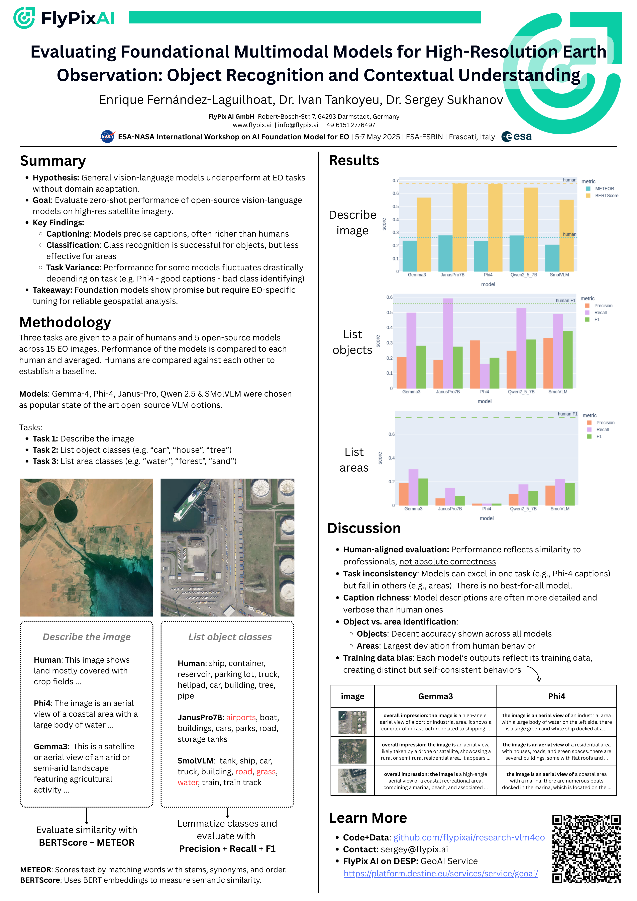

# <div align="center">VLMs for Earth Observation</div>

<div align="center">

   <a href="poster/20250505-VLM4EO.png">
     
   </a>

*Presented at ESA-NASA International Workshop on AI Foundation Model for EO | 5-7 May 2025 | ESA-ESRIN | Frascati,
Italy*

</div>

## Results

All model outputs, human labels, metrics and plots are available under [results/](results).
Images are under [images/](images).

---

## How to run

### Requirements

You need to have `uv` installed.

### Inference

1. We use HuggingFace API for inference, set your huggingface token:

```bash
HUGGINGFACE_TOKEN=hf_yourtoken
```

2. Run the models:

```bash
uv run main.py inference
```

The models, prompts, and paths are configurable in the `config.yaml` file

3. Add human labels into `results/task_N/human.csv`. The CSV must have column
   `image_name` and then one column per human.

4. Assemble results into a CSV:

```bash
uv run main.py assemble
```

This will produce a `results.csv` file.

### Evaluation

1. Run:

```bash
uv run main.py evaluation
```

This will produce `evaluation.csv` and `plot.png` in each task directory.
